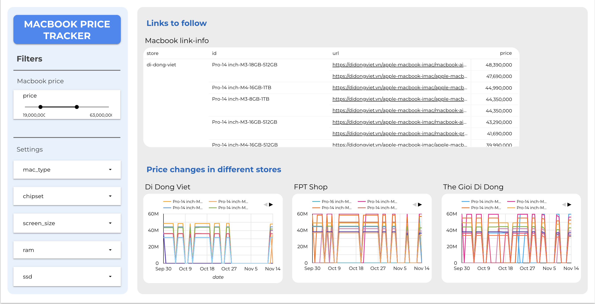

# MacBook Price Tracker

## Introduction

Tracking the prices of products can be a daunting task for me. With many retailers offering varying prices, it can be challenging to find the best deal, especially for popular items like MacBooks.

To simplify this process, I have developed a robust data pipeline that daily crawls essential websites to gather comprehensive MacBook's price data.

## Features

-   **Price Comparison**: Effortlessly compare MacBooks' prices across multiple retailers in Vietnam
-   **Automated Data Collection**: Daily crawling of prices from:
    -   [The Gioi Di Dong](https://www.thegioididong.com)
    -   [FPT Shop](https://fptshop.com.vn)
    -   [Di Dong Viet](https://didongviet.vn)

## Tools Used

-   **Python**: For web scraping and data manipulation.
-   **Crontab**: To automate the daily data retrieval process.
-   **Google Sheets**: For organizing and storing the collected data.
-   **Looker Studio**: To visualize data trends and insights.

## How It Works

1.  **Web Scraping**: The Python script crawls the specified websites to collect the latest MacBook price data.
2.  **Data Integration**: Retrieved data is structured and saved in Google Sheets for easy access and management.
3.  **Data Visualization**: Looker Studio transforms the organized data into insightful dashboards, allowing users to visualize price trends over time.

## Benefits

This price tracker not only saves users time but also empowers them to make smarter purchasing decisions. By providing reliable price comparisons, consumers can identify the best one.

## Installation

1.  Clone this repository.
2.  Install the required Python libraries.
3.  Set up Crontab for automated scraping.
4.  Connect Google Sheets and Looker Studio for data storage and visualization.

## Contact

For questions or feedback, please reach out via [caduy51\@gmail.com](mailto:caduy51@gmail.com){.email}.
